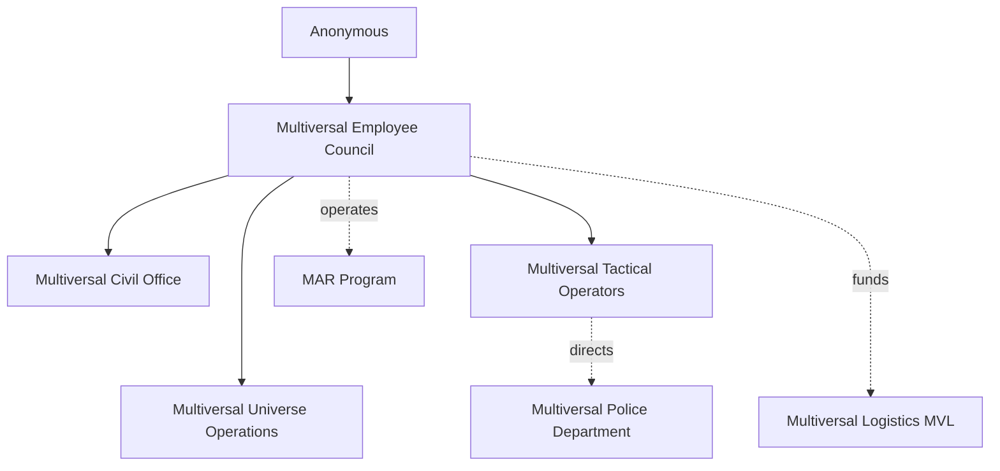

## 1. [[Anonymous]] (Origin Authority)

Anonymous is not a person, AI, deity, or organization in any human sense.

- No confirmed form (usually using a humanoid manifold to project for communication and interactions)
- No chain of command
- No observable intervention patterns

Anonymous represents the **origin layer** of the M‑VERSE.

All authority *ultimately* traces upward to Anonymous, but **Anonymous does not issue orders**. Instead, the system appears to be self‑regulating beneath them.

Anonymous is neither benevolent nor malicious. He simply *exists*, and by existing, permits everything else to exist.

---

## 2. [[MEC|Multiversal Employee Council]] (MEC)

**Role:** Supreme Administrative Authority

The MEC are often referred to—incorrectly—as *Multiversal Gods*. In truth, they are **maintainers**, **administrators**, and **architects** of reality.

### Responsibilities

- Creation of universes
- Deletion, rollback, or quarantine of universes
- Approval of major interventions
- Final arbitration during corruption events
- Oversight of *all* departments

### Authority Model

- Absolute jurisdiction
- Cannot be overruled by any other entity
- May override reality constraints directly

The MEC rarely acts directly. Most of their work is **delegative**, intervening only when corruption, systemic failure, or existential threats arise.

---

## 3. [[MUO|Multiversal Universe Operations]] (MUO)

**Role:** Staged Universe Management

MUO handles **staged universes**—universes deliberately structured to appear natural to their inhabitants.

### Example: [[SL-32]]

SL‑32 is what [[Humans]] call “reality.” It is *not* base reality—it is a controlled stage.

### MUO Responsibilities

- Prevent paradoxes
- Maintain narrative plausibility
- Mask multiversal interference
- Monitor technological thresholds
- Ensure staged universes do *not* discover the truth prematurely

MUO **prevents mistakes** before they occur.

---

## 4. [[MCO|Multiversal Civil Office]] (MCO)

**Role:** Civil Governance Across Universes

MCO manages all *non‑combat* administrative matters.

### Responsibilities

- Taxation
- Marriage & legal union recognition
- Identity registration
- Sentence rulings post‑incident
- Displacement documentation

If a human is exposed to the truth, **MCO decides their fate**.

---

## 5. [[MTO|Multiversal Tactical Operators]] (MTO)

**Role:** Military & Crisis Response Force

The MTO is the **defensive and offensive arm** of the MEC.

With infinite universes, there are infinite threats. The MTO is *never idle*.

### Authority

- Receives strategic oversight from MEC
- Overseers command individual divisions
- Sergeant Major of the MTO commands the entire force

---

### 5.1 MTO Divisions

#### Ground‑based General‑purpose Units (GGU)

- Standard combat operators
- Internal and external deployments
- Black adaptive combat armor

#### First Response Units (FRU)

- Rapid deployment specialists
- High‑mobility response
- White‑Red lightweight armor

#### Void Specialist Units (VSU)

- Void border control
- Lost personnel retrieval
- Dark‑purple voidsuits

---

## 6. [[MPD|Multiversal Police Department]] (MPD)

**Role:** Policing & Enforcement

MPD acts as law enforcement across all departments.

### Duties

- Internal discipline
- External policing
- Border enforcement
- SWAT‑level response
- Financial & taxation enforcement

MPD ensures **rules are followed**.

---

## 7. The [[MAR Program|Multiversal Assets Retrieval Program]] (MAR Program)

An Asset Recovery and Cleanup program organized by the MEC to facilitate the need for utility in recovery, hiring directly from SL-32 via protocolled practices. They serve not only Departments and Organizations, but additionally Civilians and all others.

In short, the MAR program personnel (acting as contractors) handle what others cannot afford to clean, but require anyway.

### Key Traits

- Expendable units
- Contract‑based
- Human recruits from SL‑32

### Recruitment

- Global, discreet hiring
- Heavy NDA
- Memory wipe on exit
- Cover stories for KIA

MAR retrieves:

- Lost technology
- Corpses
- Debris
- Failed experiments
- Civilian personal items, belongings, and equipment

---

## 8. [[MVL|Multiversal Logistics]] (MVL)

**Role:** Universal Manufacturer

MVL produces *everything*. Think of MVL like:

- A megacorporation
- A logistics cartel
- A state-owned-but-not-state-run entity

### Products

- Weapons
- Vehicles
- Control panels
- Domestic appliances

MVL is the **corporate backbone** of the M‑VERSE.
